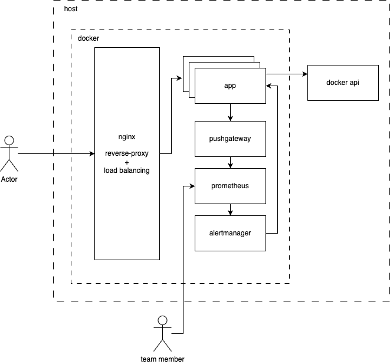

# Service Documentation

## System Architecture



### Nginx
**Role**: API-gateway.
**Features**:
- **Reverse Proxy** - provides reverse proxy functionality.
- **Load Balancing** - implements load balancing using the Round Robin algorithm.

### App (Application)
**Type**: Stateless application.
**Core Functions**:
- **GET /** - returns a description of the service.
- **GET /metrics** - provides metrics in Prometheus format.
- **POST /scale-up** - triggers a scaling script on the host machine.
- **Integration with Pushgateway** - sends metrics to Pushgateway in real-time.

### Pushgateway
**Description**: Aggregates metrics collected in the Prometheus format.

### Prometheus
**Description**: Tool for collecting and processing metrics.

### Alertmanager
**Description**: Automatically invokes the **app/scale-up** method when scaling is deemed necessary.

### Docker-API
**Description**: Facilitates interaction with Docker on the host machine through the `scale_up.sh` script.

## Software Installation

### Git
The installation process for Git can be found here: [Installing Git](https://git-scm.com/book/en/v2/Getting-Started-Installing-Git).

### Docker
Instructions for installing Docker are available here: [Installing Docker](https://docs.docker.com/engine/install/).

## Service Launch
```bash
git clone https://github.com/akablockchain1/node-express-monitoring.git
cd name_of_project
chmod +x scale_up.sh
docker-compose up -d
curl localhost
```

Service stop
```bash
docker-compose down
```

## System Testing
```bash
rm -r jmeter_results
docker-compose -f docker-compose-jmeter.yml up
# wait for jmeter-1 exited with code 0
docker-compose -f docker-compose-jmeter.yml down
# open ./jmeter_results/report/index.html
```

## Future Enhancements

- **Volumes Mapping**: for saving logs and metric data.
- **Functionality Segmentation of the Application**: splitting `app.js` into two parts: the main application and a component for interacting with the Docker-API for scaling.
- **CI/CD**: implement CI/CD via github actions.
